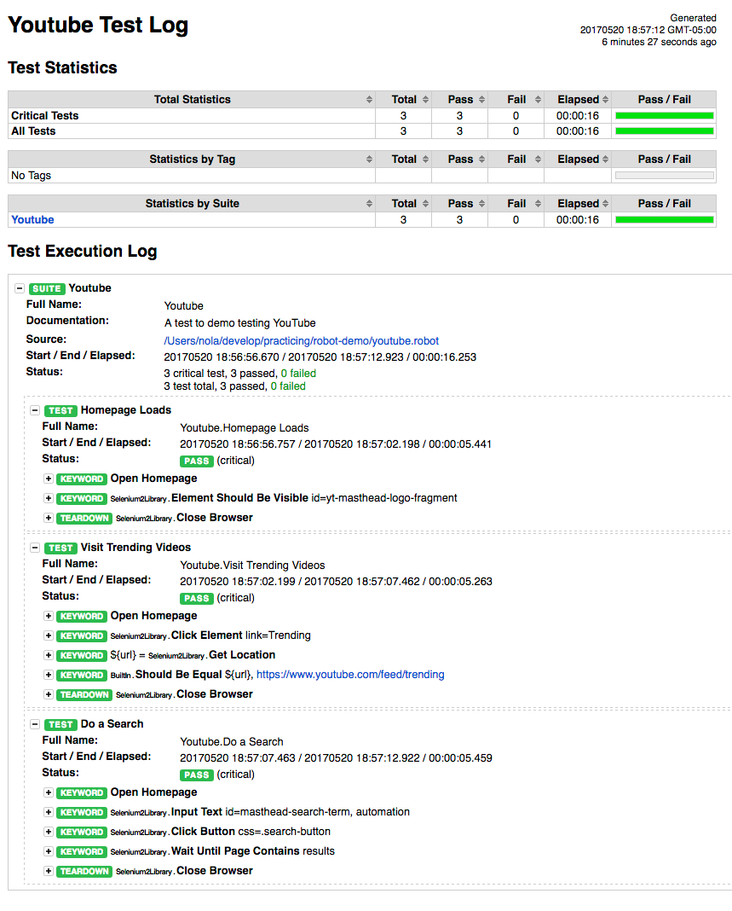

## Robot Framework Demo

This is a demo of using python's [Robot Framework](http://robotframework.org/) to test YouTube. This is just meant to show the awesomeness of this framework.

#### Needed python goodies
* Python 2.7 (Robot Framework is not ready for 3.0 yet)
* pip install robotframework
* pip install robotframework-selenium2library

#### Install selenium server
* brew install selenium-server-standalone

#### Install Chrome Driver
* brew install chromedriver 


## Running the Tests 

```
▶ robot youtube.robot
==============================================================================
Youtube :: A test to demo testing YouTube
==============================================================================
Homepage Loads                                                        | PASS |
------------------------------------------------------------------------------
Visit Trending Videos                                                 | PASS |
------------------------------------------------------------------------------
Do a Search                                                           | PASS |
------------------------------------------------------------------------------
Youtube :: A test to demo testing YouTube                             | PASS |
3 critical tests, 3 passed, 0 failed
3 tests total, 3 passed, 0 failed
==============================================================================
Output:  robot-demo/output.xml
Log:     robot-demo/log.html
Report:  robot-demo/report.html
```




